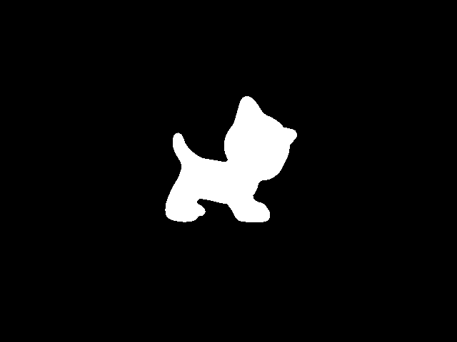

# STI-Pose
## Introduction
  The code implementation for STI-Pose (Silhouette-based 6D Object Pose Estimation).
  
  We provide the code with a script `test.py` for test.
## Project Structure
  `PSO` is the module of the O-PSO, which is adapted from the code of `sko` library.
  
  `render` is the module of the silhouette renderer, whici is adapted from the code of `vispy`. We achieve the slihouette rendering by writing shaders.
  
  `SilhouettePE.py` is the kernel algorithm implementation.
  
## Requirements
  Execute `pip install -r requirements.txt` to complete the environment configuration.
  
## Visualization
  Here are the reference silhouette image and the result silhouette image rendered with the predicted object pose.

  
  

  
